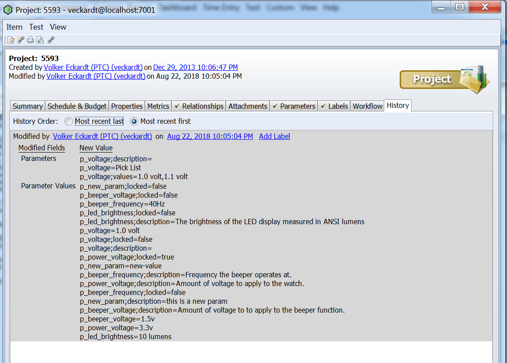

# IntegrityCopyParameters
This utility allows you to copy parameters and parameter values from one item to another.

# Hint
This is a 0.1 version, so very simple, no validation, just the copy operation.

# Important
This copy operation will overwrite all data at the target item!!!

# How to Install

Copy the dist/IntegrityCopyParameters.jar into your own Integrity Client directory
If you can not copy to the Integrity Client directory because of Windows Admin restrictions, create a new directory somewhere else and add a sub directory "lib" where you place a copy from mksapi.jar.   

# How to Use

java -jar IntegrityCopyParameters.jar --sourceItemID=101 --targetItemID=5593  --copyFields="Parameters,Parameter Values"

(You may add the usual CLI parameters like --hostname, --user, --port if needed, otherwise the default connection is taken from your Integrity Client properties)

```
Integrity Copy Parameters - V0.1
----------------------------
Reading Field Values 'Parameters,Parameter Values' from Item '101' ...
Writing Field Values 'Parameters,Parameter Values' to Item '5593' ...
Field Values 'Parameters,Parameter Values' written.
```

# Possible Result



# Tested with:
- Integrity 11.0
